<script type="text/javascript" async
  src="https://cdn.mathjax.org/mathjax/latest/MathJax.js?config=TeX-AMS-MML_HTMLorMML">
  MathJax.Hub.Config({
  tex2jax: {
    inlineMath: [['$','$'], ['\\(','\\)']],
    displayMath: [['$$','$$']],
    processEscapes: true,
    processEnvironments: true,
    skipTags: ['script', 'noscript', 'style', 'textarea', 'pre'],
    TeX: { equationNumbers: { autoNumber: "AMS" },
         extensions: ["AMSmath.js", "AMSsymbols.js"] }
  }
  });
  MathJax.Hub.Queue(function() {
    // Fix <code> tags after MathJax finishes running. This is a
    // hack to overcome a shortcoming of Markdown. Discussion at
    // https://github.com/mojombo/jekyll/issues/199
    var all = MathJax.Hub.getAllJax(), i;
    for(i = 0; i < all.length; i += 1) {
        all[i].SourceElement().parentNode.className += ' has-jax';
    }
  });

  MathJax.Hub.Config({
  // Autonumbering by mathjax
  TeX: { equationNumbers: { autoNumber: "AMS" } }
  });

</script>


<script src="https://cdn.jsdelivr.net/npm/mermaid/dist/mermaid.min.js"></script>
  <script>
    mermaid.initialize({ startOnLoad: true });
  </script>



*(Like Narcissus attempting to identify a stranger in his reflection in a pool, discourses about AI often look for systems with a "true understanding" which is strangely elusive)*


An incessant motif in the discourse surrounding AI is the distinction between *true understanding* and "mere" pattern recognition.

"...it is clear that these systems are doomed to a shallow understanding that will never approximate the full-bodied thinking we see in humans. In short, despite being among the most impressive AI systems on the planet, these AI systems will never be much like us." ([source](https://www.noemamag.com/ai-and-the-limits-of-language/))

or

"We’re simulating the surface level of it, and many people are falling for the illusion. Sometimes the performance of these machines are spectacular."
([source](https://qz.com/1088714/qa-douglas-hofstadter-on-why-ai-is-far-from-intelligent))


From this vantagepoint, modern statistical AI is little more than a trick that dupes users by a surface level understanding, but lacks a grasp of the complex, symbolic structure that underlies human cognitive ability.

This criticism has a strangely eternal quality; much the same things were said about the behaviorism, a school of thought in psychology, and later about connectionism, the intellectual precursor to today's deep learning.

<!-- The same criticisms were made of behaviorism, the scientific paradigm to which modern AI, which its end-to-end architectures feels most closely aligned: -->


But there is a second perspective worth telling about the science of the mind, and the engineering project to replicate it artificially. This perspective claims that the appearance of a dichotomy between statistical pattern recognition and true understanding is a failure of imagination.

Accordingly, the kinds of symbolic structure that we speak about loosely when making intuitive accounts of thought are figures of speech, not things we should cash out in formal terms.

If the first perspective belongs to linguists like Chomsky, vision researchers like David Marr, and philosophers like Fodor, the second is taken up by linguists like Joan Bybee,  psychologists like McClelland and Skinner, neuroscientists like Patricia Churchland, and philosophers like Quine and Dennett.

For example, McClelland: "One vision of the nature of language holds that a language consists of a set of symbolic
unit types, and a set of units of each type, together with a set of grammatical principles that constrain how these units can be used ...An alternative vision of the nature of language holds that it is often useful to characterize language as if the above statements were true, but only as a way of approximately notating or summarizing aspects of language."

Or Skinner: "I accuse cognitive scientists, as I would accuse psychoanalysts, of claiming to explore the depths of human behavior, of inventing explanatory systems which are admired for a profundity which is more properly called inaccessibility."

This debate seems to recur generation on generation (from long before Chomsky's debate with Skinner to long after it), but increasingly it is directly relevant to the engineering problem of AI. Should we leverage ideas from computer science and programming language theory to put symbolic structure into AI? Or should we be "scaling maximalists", treating the black box nature of neural nets as a feature not a bug, and train them on yet larger datasets?
It's a rare case of a philosophical debate being operationalized very directly.

<!-- If camp 1 is right, then modern AI is a futile endeavour and at the very least, needs to be fused with classical techniques. If camp 2 is right, then classical AI is a futile endeavour, and the incessant attempts to fuse it with more structured "explainable" models is a waste of time and money. -->

<!-- What is particularly interesting about this debate is that it is not so much about AI, or even cognition, as it is about the nature of things more broadly. -->


## A Bayesian perspective

Though it isn't traditionally associated with classical cognitive science and AI, phrasing the debate in the language of probability helps to locate the heart of the disagreement. Some familiarity with the notion of a probability distribution and [probabilistic graphical models](https://ermongroup.github.io/cs228-notes/representation/undirected/) is assumed in what follows, but nothing esoteric.

<!-- the linguistic notion of syntactic form is really about the sufficient statistic for meaning given form -->
<!-- concepts like systematicity are really about conditional independence of form and meaning -->

To illustrate what that means, consider a classic example, the debate between Chomsky and Skinner over the nature of language understanding.

Skinner works from the premise that everything one can say about an agent's linguistic understanding is how it relates stimulus (data) to response (actions).
 <!-- (Actually, this isn't a totally uncontroversial assumption, for reasons we'll revist at the
    end)
       (This in itself assumes a clear-cut separation of an agent from their environment, that will be worth coming back to in future.)
        -->

To be concrete, let's say that $I$ (short for *input*) is an acoustic signal corresponding to a natural language polar question (like "Were there sharks in the ocean before there were trees on land?"), and $O$ (short for *output*) is a boolean choice between "Yes" and "No". Our scientific interest is in characterizing how humans are able to answer a huge variety of such questions, previously unheard. Our engineering interest is to replicate this ability in a computer.

We choose these sets as $I$ and $O$ for the sake of a concrete example, but if you are more abstractly inclined, imagine $I$ as all sensory data received by an agent over all time until the present, and $O$ as all future actions.

In probabilistic terms, such an agent is characterized by a joint distribution $p(I, O)$. (It might look more familiar to talk about a conditional $p(O|I)$ or a prior $p(I)$, but both can be obtained from $p(I,O)$).


There's a whole range of distributions of the form $p(I,O)$, each corresponding to a different possible model of human question answering behaviour. Our goal is to specify a particular one that we think describes human behaviour correctly. Note, in the spirit of Marr's levels of explanation, that it's a separate task to work out how an agent would actually approximate $p(O|I)$ or how that approximate inference algorithm is instantiated in the brain.

More graphically, we write $p(I,O)$ as

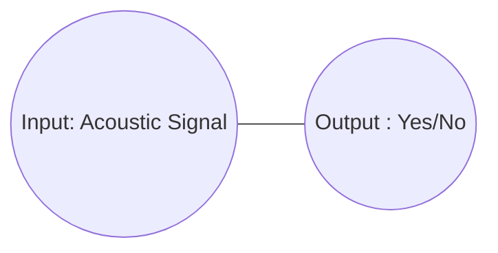

In the lingo, the diagram above denotes a *Markov random field* (MRF), which is a model specified by

$$ p(I,O) \propto f(I)f(O)f(I,O) $$

Any distribution of the form $p(I,O)$ can be expressed by such an MRF.


Chomsky does not find Skinner's approach of regarding an agent in terms of its input and output objectionable, in fact he takes it as a tautology that Skinner tries to elevate to a thesis:
    quote

His distate for it, as made famous in his review of
    Skinner's
    is that it obviates the importance of structure such as the syntactic representation of a sentence.

For context, the (very bare bones) syntactic structure of a sentence like "Echo knows Narcissus" might look something like this:

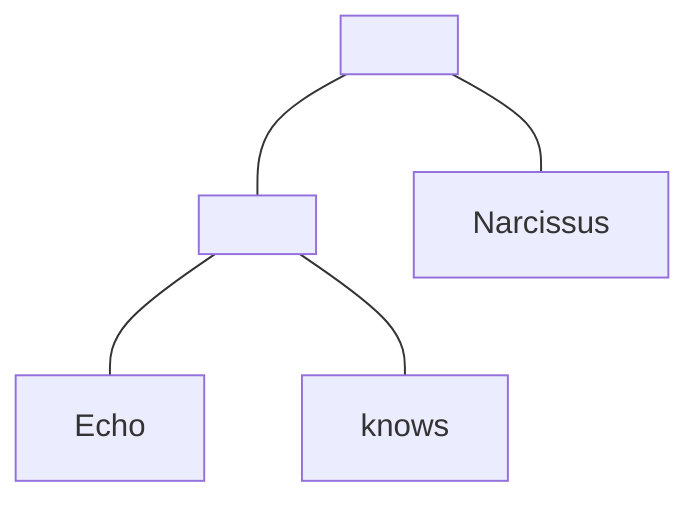

(Square boxes here as a reminder that this isn't a probabilistic graphical model, just a plain old tree).

If you think of these trees (which particular ones determined by a grammar) as living in a space `Syntax`, one can then write the following probabilistic model:


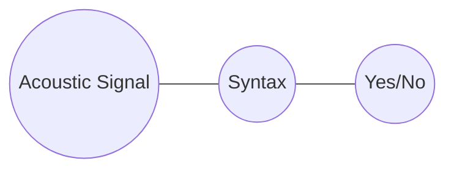

Here, elements of `Syntax` are syntax trees, so that the MRF expresses the probability of a syntactic tree corresponding to an acoustic signal, and of a yes/no answer corresponding to a syntactic tree.

More precisely, this MRF defines a distribution

$$p(I,S,O) \propto f(I)f(S)f(O)f(I,S)f(S,O)$$

and such a joint distribution $p(I,O)$ can be recovered by marginalizing out $S$  (that is: $p(I,O) = \int_S p(I,S,O)$)

In the terminology of probability, we say that we have factorized the model such that `Acoustic Signal` and `Yes/No` are **conditionally independent** given `Syntax`.

Equivalently, we say that `Syntax` is a **sufficient statistic** for `Yes/No` given `Acoustic Signal`.

What does this factorization assumption imply? The really important thing to note is that not all distributions of the form

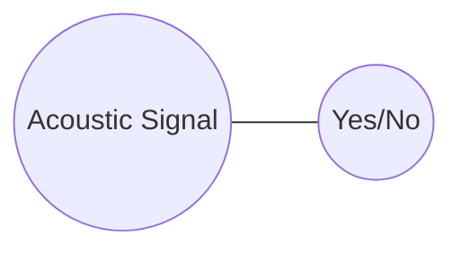

can be expressed by marginalizing out `Syntax` from a distribution of the form:


As an example of a distribution which cannot, consider the distribution in which all pairs of acoustic signals with low frequencies in their spectrum and "Yes" have the same probability.

This cannot be expressed in the factored model, because syntax trees (the denizens of `Syntax`) throw away acoustic information, so there's no way of requiring this relationship between `Acoustic Signal` and `Yes/No`.

Note that this factorization of $p(I,O)$ is not just the claim that *some* sufficient statistic like `Syntax` exists; it's always possible to choose a space $S$ such that

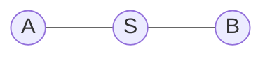

spans the same space of possible distributions as

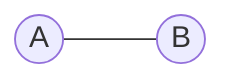

e.g. by letting $S$ by the Cartesian product of `A` and `B`. Rather, the substantive claim is that $S$ looks a certain way, in this case, that elements of `Syntax` are trees generated by a particular grammar. It is this that makes the factorization a real substantive claim.

At any rate, the intuition is that the factorization simplifies the problem by breaking it apart into two simpler questions: how sound and syntax relate, and how syntax and response relate. In other words, we can now put our focus into:

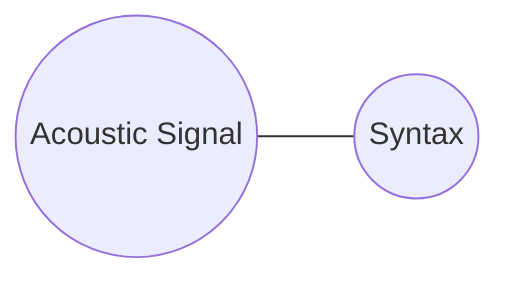

and

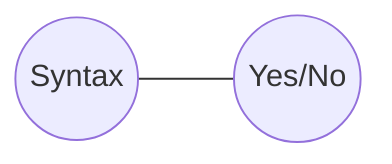

The next natural step is to factorize each of these. For example:

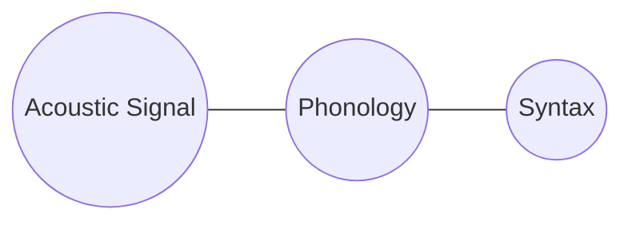

where the phonological representation in `Phonology` is a sequence of *phonemes*, constrained by a different set of rules to the syntax.

This new conditional independence assumption rules out, among others, the distribution in which all pairs of a high pitch acoustic signal and a tree with an adjective have the same probability.


Another factorization to make is:

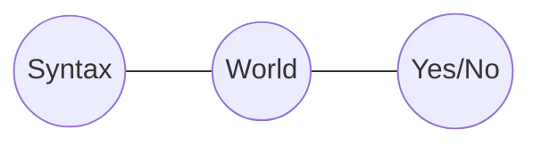

where `World` is the state of the world, i.e. the state of the system which produced all the sensory data the agent receives.

This says that the `Yes/No` answer depends on the syntax only insofar as the syntax is used to update the agent's information about the state of the world.

To give an example of the kinds of unreasonable distributions that the independence assumption rules out, a distribution in which all pairs of `Yes` and any tree with more than 4 nodes have the same probability, cannot now be defined. Unless, that is, precisely those trees correspond to some special state of the world, and we assume they do not.

<!-- Actually, if `World` is defined in this way, then it's true that this factorization is correct: -->
<!-- rao blackwell -->
<!-- Again, the substance of this claim depends entirely on what space `World` denotes. If it is the state of the physical world, then the claim is (relatively) uncontroversial,
    since the physical world underlies any data an agent might receive, and the better the agent knows about the world, the better their decision:
        see rao blackwell, neyman pearson whatev -->

Putting this all together, we have:

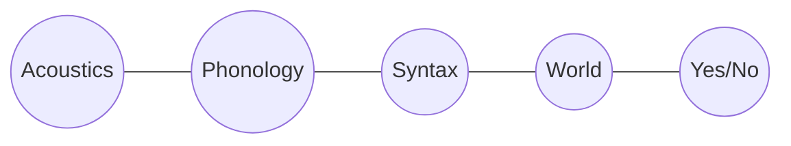

One more conditional independency that is evident from this graph is between `Phonology` and `World` given `Syntax`.

This corresponds to a well-known observation, which is that the meaning of a linguistic utterance does not depend on the way it sounds (except via the way that the sound relates to the syntax). For instance, sentences with a similar phonology like "The lion desists" and "The ion exists" may well incur very different belief updates about the state of the world.

Another example of a similar point is that it is never the case in languages that words that bear a phonological relationship (like rhyming) systematically also bear a semantic relationship (like denoting similar things).

This lack of a systematic relationship is precisely a statement about independence.

In particular, it's a statement about *conditional* independence. Phonology and semantics are not truly independent - "fly" and "flying" mean similar things, but **conditional** on syntactic (and more specifically what's called morphological structure), phonology and meaning are independent.


## Generalizing this picture

It's obvious that an answer to a given question might depend on previous questions or statements, so really we want a picture more like:

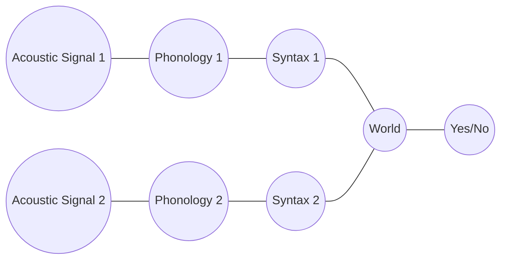

where `Acoustic Signal 2` comes after `Acoustic Signal 1`. This MRF introduces even more conditional independence assumptions. In particular, `World` is a sufficient statistic for `Acoustic Signal 2` given `Acoustic Signal 1`.

As a justification of why this might be a reasonable claim, note that an agent should indeed gain information about what a future acoustic signal is from a current one, but probably only in terms of the information about the world it contains.

For example, if the first sentence is loud, we might expect the next one to be, but only because we infer, for example, that the speaker is angry and we know that this is likely to last until the next utterance.


We can also incorporate vision into the picture being built up here (and other sensory data), since the answer to the question might depend on something you see, e.g. "what color is the cat on your lap?"


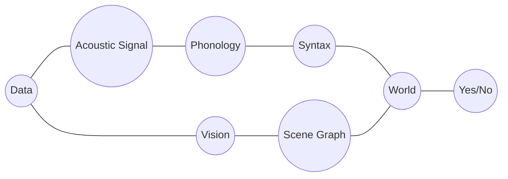

Here, `Scene Graph` is a visual analog of `Syntax`, a sufficient statistic for visual in the form of a data structure representing the objects in the world.

Does the conditional independency of `Phonology` and `Scene Graph` given `World` make sense?

As an example, it rules out distributions in which all pairs of a phonological structure containing a /b/ phoneme, and scene graps containing a chair have the same probability, which seems sensible.

And it allows distributions in which precisely those phonological structures which correspond to sentences about chairs have higher probability than not of appearing with scene graphs containing chairs.

# Abstraction



*(Narcissus again. The relationship between the pictures is mediated by their content, i.e. the thing they depict, and other variables like style.)*

<!-- ```mermaid
graph LR
    X((Sentence i)) --- D((Content)) --- A((Sentence j))
``` -->

The upshot is that whenever we want to abstract away from a low-level datum (like an acoustic signal or an action), we are invoking a latent variable and a conditional independence assumption.

For instance, it is totally natural to think of Harry Potter and the Philosopher's Stone not as a particular physical object, or even as a sequence of characters, but as a semantic object.

As a testament to the fact that we are comfortable with this, note that it seems uncontroversial to claim that this book in French is "the same" as the book in English. If a polyglot says they have read Harry Potter, we don't need to know in what language to understand what they mean.

And what this amounts to is the belief that there is a latent variable given which the sequence of characters of Harry Potter and the Philosopher's Stone in any two languages are conditionally independent.

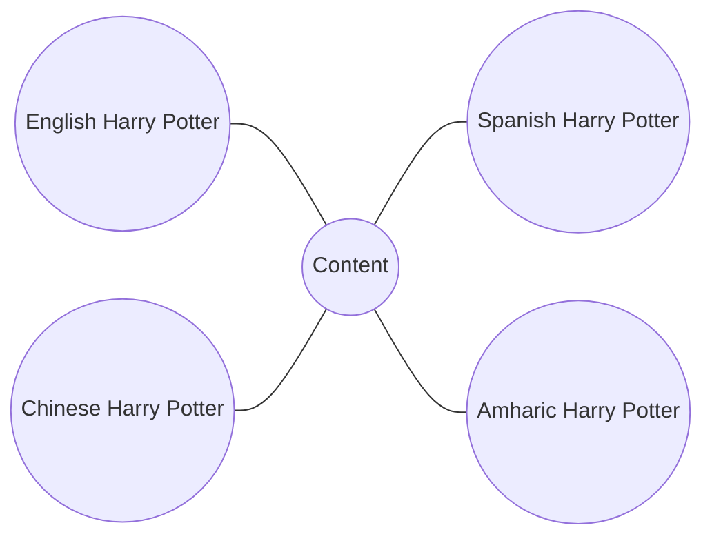

To put it more succinctly: to believe that translation is possible is to belief that semantic content is a sufficient statistic of the various written forms.


<!-- ```mermaid
graph LR
    X((Current Fashion)) --- D((Style)) --- A((Future Fashion))
``` -->


<!-- There are many other examples that could be given of factorizations of $p(I,O)$. For example, we haven't even touched on the ways in which the space of actions that an agent can perform relates to the agent's belief about the state of the world, and how this factors.  -->

<!-- ## Other examples in cognitive science


action doesn't depend on whole of world

conditional independence of future of data from past of actions:
    actually not that obvious -->


<!-- Why a joint distribution? To understand this, note that from the joint distribution, we can obtain expressions for $p(A|D)$ and $p(D)$, i.e. a description of how the agent acts given data, and what the agent believes about the data prior to receiving any. -->


<!-- As such, our scientific goal is to identify what distribution of the form $p(D,A)$ describes a natural agent, like a person. And correspondingly, an engineering goal would be to define such a distribution and draw samples from it (or its conditionals).  -->


<!-- Note that there is a distinction between the *computational specification* of the agent, namely $p(D,A)$, the *algorithmic specification* of approximate inference algorithms efficient enough (in both the computing and statistical sense) to be useful, and the *biological implementation*.  -->


<!-- Everything said so far is consistent with almost any position on the brain: it meets the rare criterion of being something both Skinner and Chomsky would agree to -->


<!-- quote attesting to this -->

<!-- But it also is saying almost nothing (not *quite* nothing though!) -->


## Returning to the debate

The difference between modern and classical AI has nothing to do with the presence or absence of probability in the theory, or the presence or absence of data.
    footnote: for example, the picture sketched out above is entirely classical in its spirit, but entirely Bayesian in its tools.

Rather, it is about how the distribution that describes an agent $p(I,O)$ is factored.

Classical AI and cognitive science makes strong claims about the factoring, often introducing intermediate variables whose values are data types from computer science, like trees or graphs.
    hence the term *symbolic AI*

<!-- A classic example, discussed above, is that a tree structured
    called the syntax is the sufficient statistic for
    *Syntax is the sufficient statistic for meaning given sound*. -->

<!-- The whole point of the outpouring of work in the
was to characterize this sufficient statistic, often just using people's internal judgments of what sentences sounded grammatical. -->

Modern AI, along with behaviorism, makes much weaker claims.
The most radical version (in the sense of "radical behaviorism") claims that there is *no* kind of factorization assumption that holds other than trivial ones.
On this perspective, the end-to-end, black box nature of modern neural AI - lack of (spurious) conditional independency - is what makes it work.

<!--
for example, recall
French Harry Potter - Content - English Harry Potter

The claim is that there this sufficient statistic, the `Content` of the book, doesn't exist, or rather only exists if we let it be
    everything.
what Quine means by the indeterminacy of translation is that
there is -->

And while it's possible to regard a neural net as an amortized inference algorithm for an underlying probabilistic model $p(I,O)$, the various intermediate variables of classical AI do not appear.

As an example, take neural translation. One can view a complex model like a transformer, trained on pairs of English and French sentences, as learning an underlying distribution $p(I,O)$ (where $I$ is the English sentence and $O$ is the French one). However, none of the intervening variables, like `Phonology`, `Syntax` or `Content` are present explicitly, nor are these structures really possible to retrieve from the net at all.


Weaker claims should be preferred over stronger ones in the absence of evidence. So what does the evidence for the stronger claims of classical AI and cognitive science look like?

The first class of arguments are what I would call *appeals to poverty of stimulus*.

They go like this: if there were no conditional independencies, the distribution $p(D,A)$ would be unlearnable or, as in the case of neural nets, would require orders of magnitude more data to learn than a human does.  (In Chomsky's words: "By the age of four or five (normal) children have an almost limitless capacity to understand and produce sentences which they have never heard before.")

<!-- Here, the response a Quine or a Skinner might make is this:
humans are exposed to an enormous non-stop multimodal stream of data, and what's more, they have the inductive biases of millions of years of evolution. If you think of the training cost of, say GPT3, as playing catch up with evolution, then the comparison to human learning is much less clear cut. -->

<!-- The next class of argumets are *appeals to systematicity* They go like this: the kinds of agent models that the conditional independency assumptions of classical AI rule out are exactly the kinds of models that we don't see evidenced in humans. -->


<!-- This argument is the hardest to rebut. The approach here is to press on whether this apparent systematicity is really there.

    Most tellingly, it
        is often made in terms of other proposed sufficient statistics:
        for example, systematicity in
            presupposes a ]

    But phonological structure, syntactic structure, and logical form, are all themselves posited:
        so we are

    neural networks exhibit apparent systematicity

        Tasks that computers can now perform extremely well,
        anyone with half a brain could have told you that it was obvious that no system without a symbolic representation of phonology or phonetics could possibly
            reliably recognize speech.
   -->


<!-- And certainly, the evidence for stronger claims is far from compelling -->

Another set of arguments are what you could call *appeals to "duh!"*. They go like this: people can identify grammatical structure, visual structure (objects in a scene), and many other symbolic objects that appear in cognition. When someone tells me that my keys are in the kitchen, and I go to the kitchen, it would be bizarre to understand that behavior in terms of the acoustic signal I receive and the motor movements I make. It just seems obvious that these things are *there* and need to be worked into AI systems.

<!-- "modern AI obviates something which *obviously* exists." -->

<!-- Here, it's worth bearing in my how unreliable human intuition is here.
On the other hand, while these symbolic representations certainly seem present and clear from a distance, they have a suspiciously elusive quality in practice.
    There are two possibilities:
        one is that the sheer complexity of these objects precludes
        the other is that they are at best ways of talking -->


<!-- Response:
    language and thought are full of concepts which do not translate directly into
        Just because we speak about people's personalities does not mean that a "personality" is a special variable in the -->

While there are ways to respond to both these criticisms, it is futile, of course, to try to give a final word on which side is right. But to the extent that it's possible to arbitrate, it's worth doing it in a probabilistic language


<!-- # The mind as software

It's worth coming back to the original assumption that an agent can be modeled as a distribution $p(I,O)$.

What assumptions are we making by doing this?

approximate (but so was everything else):
    Data - "World" - Action

`World` =

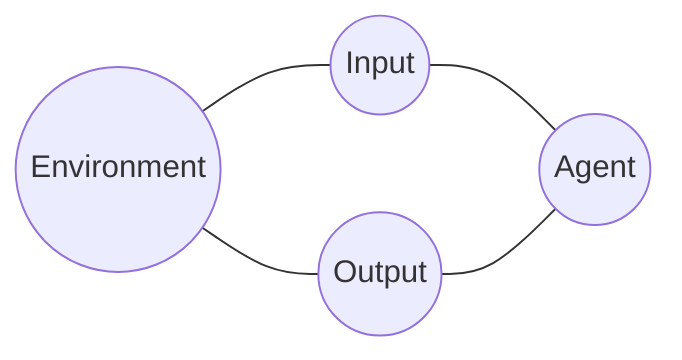


Agent = compile ( approximate (
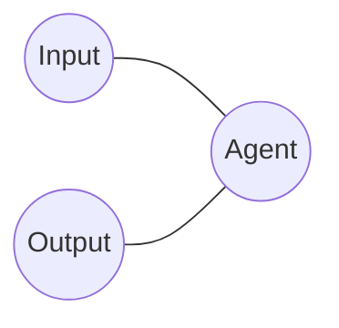
))


Brain - Mind - Behavior

articulate the point about the two levels better:
    ...


        Data
Brain -   |
        Action


                Data
Brain - Mind -    |
                Action

where Mind is a computable function

p(Data)


# hello example

hello example

What does this factorization of the probability distribution imply?

Certainly, a wide range of distributions are still possible. But importantly, some are not. Which?

For example, imagine a distribution p(image, text) that assigned 0 probability to all and only pairs of images with red pixels and text of palindromes (see figure)

This distribution is not in the class of distributions expressable in the factored form above. To see why, say that some such pair

    abba <-> image
    had 0 probability.
    Now suppose we changed the image to
    figure

    Then the probability

## Essentialism is also about conditional independence

essential gender

data - world + gender - actions

## manifest image

 Sellars
        distinguishes between the scientific image - the world
            and the manifest image - the world
                full of ideas, trombones, emotions, elbows, longing, and death. Among other things.
                    propositions, percepts,

    The debate is really about objects in the manifest image:
        are they to be handled
            or dissolved
                as linguistic

        two camps
        Also discussed often, but less,
            is the connection to philosophy
    What is less often discussed is that this kind of thinking is part of a larger debate in philosophy:
        of *essentialist* thinking vs ...


key question at the heart of AI is: what is the nature of things?


# Tutorial


To get an intuition for what this means for an agent, let's consider an artificial agent which sees 100 coin flips of a single coin, and then takes the action of deciding whether the coin is biased.

Here $D$ is the sequence of coin flips, $A$ is either "yes, biased", or "no, unbiased".

    A =
    D =
    S =

    vision example
    language example


What is being claimed by such a factorization? Mathematically speaking, we say that figure
    describes the set of distributions in which $D$ and $A$ are conditionally independent given $S$.

    the model should be such that the data space and action space only depend on each other through the state of the world.

So it rules out some possible distributions.
Like what? What is a possible distribution p(A,D), i.e. a possible agent, that is ruled out by this assumption?

In the example of the coin flipper:
    if a prime number, more likely

further factorizations are possible: we can now ask: what about other...

the state of the world is a sufficient statistic for actions given data:
    an agent's decision of how to act should only depend on the data up to the information the data gives about the latent state of the world. -->


<div class="mermaid">
graph LR;
    A((A)) --> B((B));
</div>
<script async src="https://unpkg.com/mermaid@8.2.3/dist/mermaid.min.js"></script>
