<script type="text/javascript" async
  src="https://cdn.mathjax.org/mathjax/latest/MathJax.js?config=TeX-AMS-MML_HTMLorMML">
  MathJax.Hub.Config({
  tex2jax: {
    inlineMath: [['$','$'], ['\\(','\\)']],
    displayMath: [['$$','$$']],
    processEscapes: true,
    processEnvironments: true,
    skipTags: ['script', 'noscript', 'style', 'textarea', 'pre'],
    TeX: { equationNumbers: { autoNumber: "AMS" },
         extensions: ["AMSmath.js", "AMSsymbols.js"] }
  }
  });
  MathJax.Hub.Queue(function() {
    // Fix <code> tags after MathJax finishes running. This is a
    // hack to overcome a shortcoming of Markdown. Discussion at
    // https://github.com/mojombo/jekyll/issues/199
    var all = MathJax.Hub.getAllJax(), i;
    for(i = 0; i < all.length; i += 1) {
        all[i].SourceElement().parentNode.className += ' has-jax';
    }
  });

  MathJax.Hub.Config({
  // Autonumbering by mathjax
  TeX: { equationNumbers: { autoNumber: "AMS" } }
  });

</script>


## Language


the relationship between sound and meaning is arbitrary, in the sense that once you have taken into account historical accident and
	morphological structure, the way a word sounds and what it means are independent.


A Bayesian perspective

Though it isn't traditionally associated with classical cognitive science and AI, I think the language of probability (graphical models and conditional independence assumptions in particular) provides a very useful framing.

To illustrate what that means, consider a classic example, the debate between Chomsky and Skinner over the nature of language understanding.

Skinner works from the premise that everything one can say about an agent's linguistic understanding is how it relates stimulus (data) to response (actions).

To be concrete, let's say that $I$ (short for *input*) is an acoustic signal corresponding to a natural language polar question (like "Were there sharks in the ocean before there were trees on land?"), and $O$ (short for *output*) is a boolean choice between "Yes" and "No". Our scientific interest is in characterizing the mapping from $I$ to $O$, which describes how humans are able to answer a huge variety of such questions, previously unheard. Our engineering interest is to replicate this ability in a computer.

We choose these sets as $I$ and $O$ for the sake of a concrete example, but if you are more abstractly inclined, imagine $I$ as all sensory data received by an agent over all time until the present, and $O$ as all future actions.

In probabilistic terms, such an agent is characterized by a joint distribution $p(I, O)$. (It might look more familiar to talk about a conditional $p(O|I)$ or a prior $p(I)$, but both can be obtained from $p(I,O)$).


There's a whole range of distributions of the form $p(I,O)$, each corresponding to a different possible model of human question answering behavior. Our goal is to specify a particular one that we think describes human behavior correctly. Note, in the spirit of Marr's levels of explanation, that it's a separate task to work out how an agent would actually approximate $p(O|I)$ or how that approximate inference algorithm is instantiated in the brain.

More graphically, we write $p(I,O)$ as

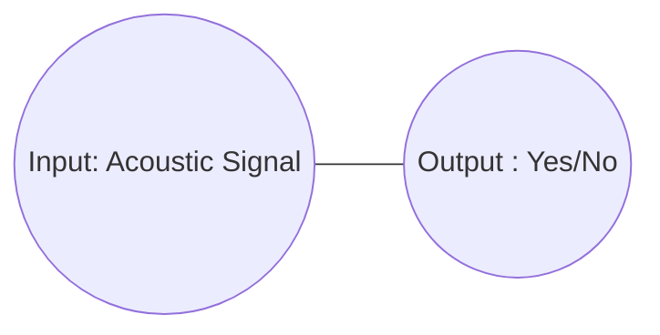

In the lingo, the diagram above denotes a *Markov random field* (MRF), which is a model specified by

$$ p(I,O) \propto f(I)f(O)f(I,O) $$


Chomsky does not find Skinner's approach of regarding an agent in terms of its input and output objectionable, in fact he takes it as a tautology that Skinner tries to elevate to a thesis. His distate for it is that it obviates the importance of structure such as the syntactic representation of a sentence.

For context, the (very bare bones) syntactic structure of a sentence like "Echo knows Narcissus" might look something like this:

```
           /\
          /  \  
         /    \
        /     /\
       /     /  \
      /     /    \
Narcissus knows Echo

```

If you think of these trees (which particular ones determined by a grammar) as living in a space `Syntax`, one can then write the following probabilistic model:


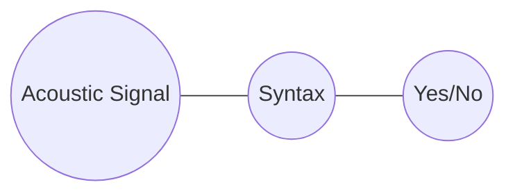

Here, elements of `Syntax` are syntax trees, so that the MRF expresses the probability of a syntactic tree corresponding to an acoustic signal, and of a yes/no answer corresponding to a syntactic tree.

More precisely, this MRF defines a distribution

$$p(I,S,O) \propto f(I)f(S)f(O)f(I,S)f(S,O)$$

and such a joint distribution $p(I,O)$ can be recovered by marginalizing out $S$  (that is: $p(I,O) = \int_S p(I,S,O)$)

In the terminology of probability, we say that we have factorized the model such that `Acoustic Signal` and `Yes/No` are **conditionally independent** given `Syntax`.

Equivalently, we say that `Syntax` is a **sufficient statistic** for `Yes/No` given `Acoustic Signal`.

What does this factorization assumption imply? The really important thing to note is that not all distributions of the form

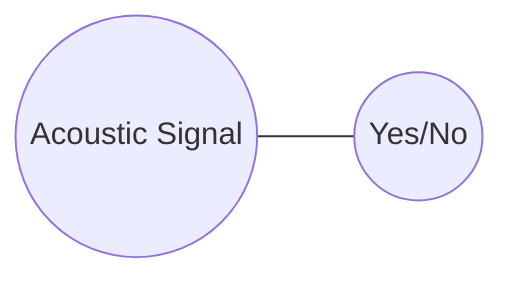

can be expressed by marginalizing out `Syntax` from a distribution of the form:


As an example of a distribution which cannot, consider the distribution in which all pairs of acoustic signals with low frequencies in their spectrum and "Yes" have the same probability.

This cannot be expressed in the factored model, because syntax trees (the denizens of `Syntax`) throw away acoustic information, so there's no way of requiring this relationship between `Acoustic Signal` and `Yes/No`.

Note that this factorization of $p(I,O)$ is not just the claim that *some* sufficient statistic like `Syntax` exists; it's always possible to choose a space $S$ such that

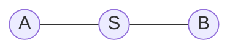

spans the same space of possible distributions as

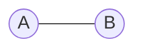

e.g. by letting $S$ by the Cartesian product of `A` and `B`. Rather, the substantive claim is that $S$ looks a certain way, in this case, that elements of `Syntax` are trees generated by a particular grammar. It is this that makes the factorization a real substantive claim.

At any rate, the intuition is that the factorization simplifies the problem by breaking it apart into two simpler questions: how sound and syntax relate, and how syntax and response relate. In other words, we can now put our focus into:

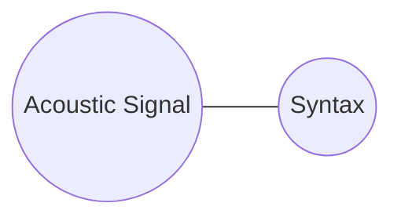

and

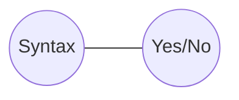

The next natural step is to factorize each of these. For example:

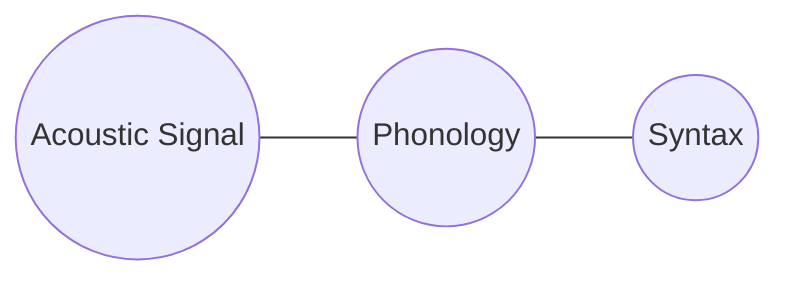

where the phonological representation in `Phonology` is a sequence of *phonemes*, constrained by a different set of rules to the syntax.

This new conditional independence assumption rules out, among others, the distribution in which all pairs of a high pitch acoustic signal and a tree with an adjective have the same probability.


Another factorization to make is:

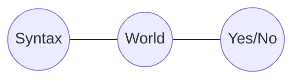

where `World` is the state of the world, i.e. the state of the system which produced all the sensory data the agent receives.

This says that the `Yes/No` answer depends on the syntax only insofar as the syntax is used to update the agent's information about the state of the world.

To give an example of the kinds of unreasonable distributions that the independence assumption rules out, a distribution in which all pairs of `Yes` and any tree with more than 4 nodes have the same probability, cannot now be defined. Unless, that is, precisely those trees correspond to some special state of the world, and we assume they do not.

Putting this all together, we have:

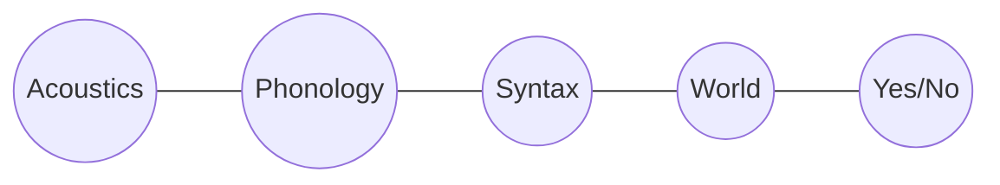

One more conditional independency that is evident from this graph is between `Phonology` and `World` given `Syntax`.

This corresponds to a well-known observation, which is that the meaning of a linguistic utterance does not depend on the way it sounds (except via the way that the sound relates to the syntax). For instance, sentences with a similar phonology like "The lion desists" and "The ion exists" may well incur very different belief updates about the state of the world.

Another example of a similar point is that it is never the case in languages that words that bear a phonological relationship (like rhyming) systematically also bear a semantic relationship (like denoting similar things).

This lack of a systematic relationship is precisely a statement about independence.

In particular, it's a statement about *conditional* independence. Phonology and semantics are not truly independent - "fly" and "flying" mean similar things, but **conditional** on syntactic (and more specifically what's called morphological structure), phonology and meaning are independent.


## Generalizing this picture

It's obvious that an answer to a given question might depend on previous questions or statements, so really we want a picture more like:

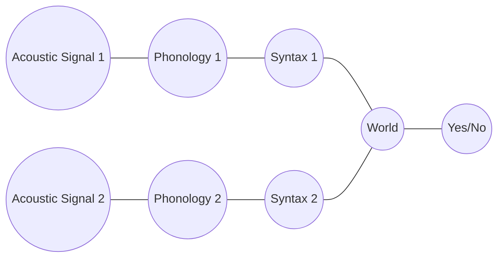

where `Acoustic Signal 2` comes after `Acoustic Signal 1`. This MRF introduces even more conditional independence assumptions. In particular, `World` is a sufficient statistic for `Acoustic Signal 2` given `Acoustic Signal 1`.

As a justification of why this might be a reasonable claim, note that an agent should indeed gain information about what a future acoustic signal is from a current one, but probably only in terms of the information about the world it contains.

For example, if the first sentence is loud, we might expect the next one to be, but only because we infer, for example, that the speaker is angry and we know that this is likely to last until the next utterance.


We can also incorporate vision into the picture being built up here (and other sensory data), since the answer to the question might depend on something you see, e.g. "what color is the cat on your lap?"


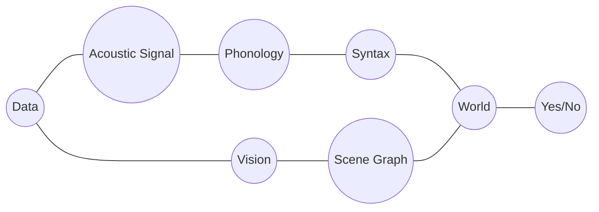

Here, `Scene Graph` is a visual analog of `Syntax`, a sufficient statistic for visual in the form of a data structure representing the objects in the world.

Does the conditional independency of `Phonology` and `Scene Graph` given `World` make sense?

As an example, it rules out distributions in which all pairs of a phonological structure containing a /b/ phoneme, and scene graps containing a chair have the same probability, which seems sensible.

And it allows distributions in which precisely those phonological structures which correspond to sentences about chairs have higher probability than not of appearing with scene graphs containing chairs.

# Abstraction


The upshot is that whenever we want to abstract away from a low-level datum (like an acoustic signal or an action), we are invoking a latent variable and a conditional independence assumption.

For instance, it is totally natural to think of Harry Potter and the Philosopher's Stone not as a particular physical object, or even as a sequence of characters, but as a semantic object.

As a testament to the fact that we are comfortable with this, note that it seems uncontroversial to claim that this book in French is "the same" as the book in English. If a polyglot says they have read Harry Potter, we don't need to know in what language to understand what they mean.

And what this amounts to is the belief that there is a latent variable given which the sequence of characters of Harry Potter and the Philosopher's Stone in any two languages are conditionally independent.

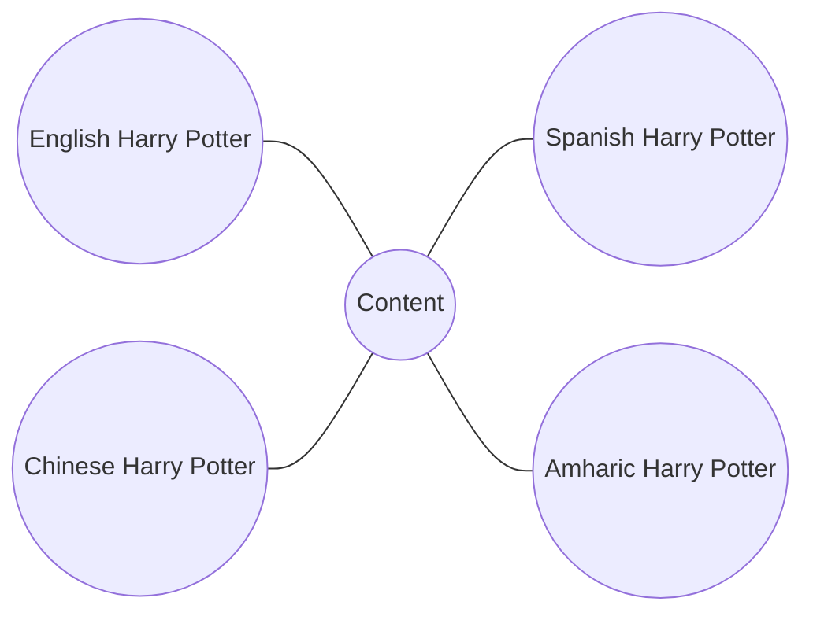

To put it more succinctly: to believe that translation is possible is to belief that semantic content is a sufficient statistic of the various written forms.


## Returning to the debate

The difference between modern and classical AI has nothing to do with the presence or absence of probability in the theory, or the presence or absence of data. Rather, it is about how the distribution that describes an agent $p(I,O)$ is factored.

Classical AI and cognitive science makes strong claims about the factoring, often introducing intermediate variables whose values are data types from computer science, like trees or graphs, hence the term *symbolic AI*

Modern AI, reminiscent of behaviorism, makes much weaker claims. View ChatGPT as a. learned version of a distribution $p(I,O)$. ChatGPT's version of $p(I,O)$ clearly resembles a person's $p(I,O)$ in ways which are hard to dismiss (though the extent to which it "really" understands beyond superficial structure is a topic of continual debate).

But there is *no* kind of factorization assumption in the model. Or rather, there are intermediate latent variables in the system's architecture, but they don't correspond to anything obviously interpretable, like syntactic structure, or a 1st order logic's representation of world knowledge.

Is this a bad thing? A good thing? That rather depends on whether you believe those latent variables are part of the true structure of the world. If yes, then something like ChatGPT can only perform well to the extent that it approximates them.

On the other hand, if you are sceptical about the nature of these latent variables, then their absence in neural AI systems might seem rather like a feature. Of course, being sceptical about things like syntactic structure or sentential meaning is a hard route to go down (see the above examples) and you need to explain why these things *appear* to be present in cognition.


Weaker claims should be preferred over stronger ones in the absence of evidence. So what does the evidence for the stronger claims of classical AI and cognitive science look like?

The first class of arguments are what I would call *appeals to poverty of stimulus*.

They go like this: if there were no conditional independencies, the distribution $p(I,O)$ would be unlearnable or, as in the case of neural nets, would require orders of magnitude more data to learn than a human does.  (In Chomsky's words: "By the age of four or five (normal) children have an almost limitless capacity to understand and produce sentences which they have never heard before.")


<!-- Here, the response a Quine or a Skinner might make is this:
humans are exposed to an enormous non-stop multimodal stream of data, and what's more, they have the inductive biases of millions of years of evolution. If you think of the training cost of, say GPT3, as playing catch up with evolution, then the comparison to human learning is much less clear cut. -->


The other set of arguments are what you could call *appeals to "duh!"*. They go like this: people can identify grammatical structure, visual structure (objects in a scene), and many other symbolic objects that appear in cognition. When someone tells me that my keys are in the kitchen, and I go to the kitchen, it would be bizarre to understand that behavior in terms of the acoustic signal I receive and the motor movements I make. It just seems obvious that these things are *there* and need to be worked into AI systems.

While there are ways to respond to both these criticisms, it is futile, of course, to try to give a final word on which side is right.
