narcissus picture (and later the second one)
    (Like Narcissus attempting to identify a stranger in his reflection in a pool, discourses about AI often look for a true
        understanding which is nowhere to be found)

An incessant motif in the discourse surrounding AI is the distinction between *true understanding* and "mere" pattern recognition.

    "it is clear that these systems are doomed to a shallow understanding that will never approximate the full-bodied thinking we see in humans. In short, despite being among the most impressive AI systems on the planet, these AI systems will never be much like us."

    hofstadter one

    one about connectionisms in word learning debate

From this vantagepoint, modern, statistical AI is little more than a trick that dupes users by a surface level understanding, but lacks a grasp of the complex, symbolic structure that underlies human cognitive ability.

This criticism has a strangely eternal quality; similar things were said about the behaviorism, a school of thought in psychology:

quote
Chomsky quote

and connectionism, a school of thought in psychology and AI:

quote

<!-- The same criticisms were made of behaviorism, the scientific paradigm to which modern AI, which its end-to-end architectures feels most closely aligned: -->


But there is a second perspective worth telling about the science of thought, and the engineering project to replicate it artificially.

This second perspective tells that the appearance of a dichotomy between statistical pattern recognition and true understanding is a failure of imagination.

    It

    kinds of symbolic structure that we speak about loosely when making intuitive accounts of thought are figurative, not things we want to cash out in mathematical terms.

If the first perspective belongs to linguists like Chomsky, vision researchers like David Marr, and philosophers like Fodor

the second is taken up by linguists like
    Joan
    psychologists like McClelland
    neuroscientists like Patricia Churchland
    philosophers and Quine

mcclelland quote:
quote

or skinner, plotting a return from exile:
quote

It's a rare case of a philosophical debate being operationalized very directly. If camp 1 are right, then modern AI is a futile endeavour and at the very least, needs to be fused with classical techniques. If camp 2 are right, then classical AI is a futile endeavour, and the incessant attempts to
    fuse it with more structured "explainable" models is a waste of time and money.

<!-- What is particularly interesting about this debate is that it is not so much about AI, or even cognition, as it is about the nature of things more broadly. -->


## A Bayesian perspective on classical cognitive science

Though it isn't traditionally associated with classical cognitive science and AI, phrasing the debate in the language of probability helps to locate the heart of the disagreement. Some familiarity with the notion of a probability distribution and [probabilistic graphical models](https://ermongroup.github.io/cs228-notes/representation/undirected/) is assumed in what follows, but nothing esoteric.

<!-- the linguistic notion of syntactic form is really about the sufficient statistic for meaning given form -->
<!-- concepts like systematicity are really about conditional independence of form and meaning -->

To illustrate what that means, consider a classic example, the debate between Chomsky and Skinner over the nature of language understanding.

Skinner works from the premise that everything one can say about an agent's linguistic understanding is how it relates stimulus (data) to response (actions).

To be concrete, let's say that $I$ (short for *input*) is an acoustic signal corresponding to a natural language polar question (like "Were there sharks in the ocean before there were trees on land?"), and $O$ (short for *output*) is a boolean choice between "Yes" and "No". Our scientific interest is in characterizing how humans are able to answer a huge variety of such questions,
    previously unheard by them.
    Our engineering interest is to replicate this in a computer.

We choose these values for $I$ and $O$ for the sake of a concrete example, but if you are more abstractly inclined, imagine $I$ as all sensory data received by an agent over all time until the present, and $O$ as all future actions.

In probabilistic terms, such an agent is characterized by a joint distribution $p(I, O)$. (It might look more familiar to talk about a conditional $p(O|I)$ or a prior $p(I)$, but both are given by $p(I,O)$.

     (Actually, this isn't a totally uncontroversial assumption, for reasons we'll revist at the
    end)
       (This in itself assumes a clear-cut separation of an agent from their environment, that will be worth coming back to in future.)
       todo


There's a whole range of distributions of the form $p(I,O)$. Our goal is to specify a particular one which describes human question answering behavior. Note, in the spirit of Marr's levels of explanation, that it's a separate task to work out how an agent would actually approximate $p(O|I)$ or how that approximate inference algorithm is instantiated in the brain.


More graphically, we write $p(I,O)$ as

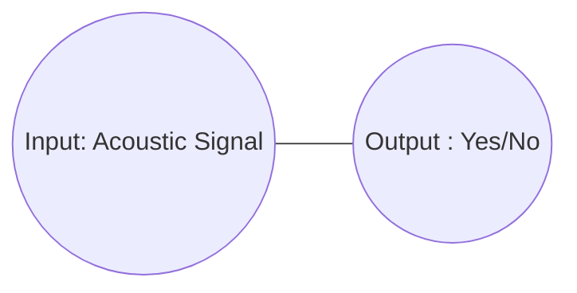

In the lingo, the diagram above denotes a *Markov random field* (MRF), which is a model specified by

$$ p(I,O) \propto f(I)f(O)f(I,O) $$

Any distribution of the form $p(I,O)$ can be expressed by such an MRF.


Chomsky does not find this claim objectionable, in fact he takes it as a tautology that Skinner tries to elevate to a thesis:
    quote

His distate for it,
    as made famously in his review of
    is that it obviates the importance of structure such as the syntactic representation of a sentence.

A sentence's syntactic structure looks something like:

todo

and refer to the space of all such trees as `Syntax`

What does that mean in probabilistic terms? It means a graphical model like this:

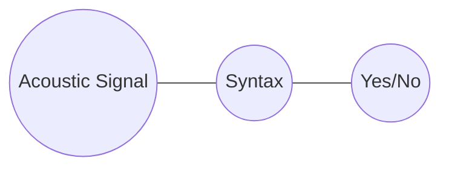

Here, elements of `Syntax` are syntactic trees, so that the MRF expresses the probability of a syntactic tree corresponding to an acoustic signal, and of a yes/no answer corresponding to a syntactic tree.

More precisely, this MRF defines a distribution

$$p_s(I,S,O) \propto f(I)f(S)f(O)f(I,S)f(S,O)$$

and such a joint distribution $p_s(I,O)$ can be recovered by marginalizing out $S$  (that is: $p_s(I,O) = \int_S p_s(I,S,O)$)

In the terminology of probability, we say that we have factorized the model such that `Acoustic Signal` and `Yes/No` are **conditionally independent** given `Syntax`.

Equivalently, we say that `Syntax` is a **sufficient statistic** for `Yes/No` given `Acoustic Signal`.

What does this factorization assumption imply? The really important thing to note is that not all distributions of the form

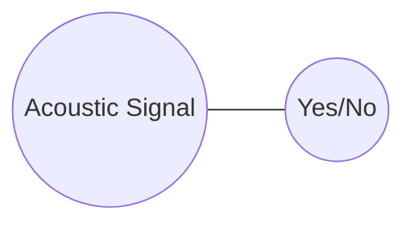

can be expressed in the form


As an example of a distribution which cannot, consider the distribution in which all acoustic signals with certain frequencies in their spectrum correspond to "Yes" with probability $1$, and all other signals correspond to "No" with probability $1$.


This cannot be expressed in the factored setting, because syntax trees (the denizens of `Syntax`) throw away acoustic information.


Note that this factorization of $p(I,O)$ is not just the claim that *some* sufficient statistic like `Syntax` exists; it's always possible to choose a space $S$ such that

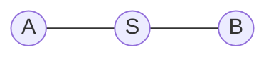

spans the same space of possible distributions as

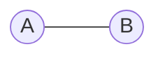

e.g. by letting $S$ by the Cartesian product of `A` and `B`. Rather, the substantive claim is that $S$ looks a certain way, in this case, that elements of `Syntax` are trees generated by a particular grammar. It is this that makes the factorization a real substantive claim.

At any rate, the intuition is that the factorization simplifies the problem by breaking it apart into a question of how sound and syntax relate, and how syntax and response relate. In other words, we can now put our focus into:

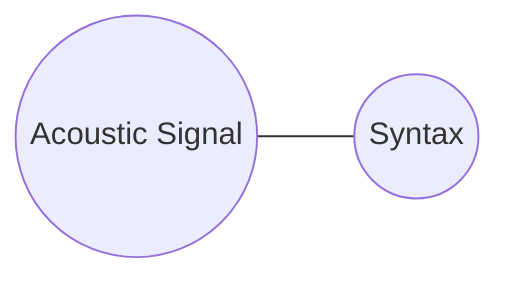

and

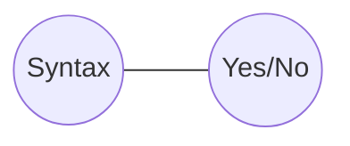

The next natural step is to factorize each of these. For example:

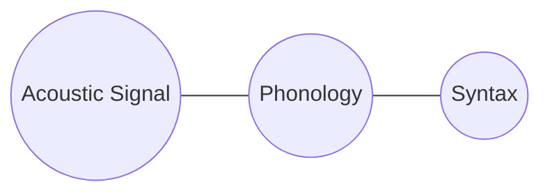

where the phonological representation in `Phonology` is a sequence
    of *phonemes*, constrained by a different set of rules to the syntax.

phonology is the :
    this says that, for example,
        variation in the pitch of the incoming sound is only relevant to determining the syntactic structure to the extent that the pitch determines the phonological structure

           In particular, any distribution in which:
        person makes an action A
            if and only if the sentence rhymes with
            similar sounding words connote similar


A second factorization is:

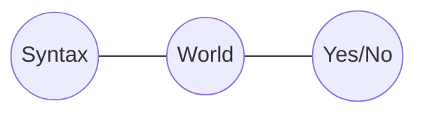

where `World` is the state of the world, i.e. the state of the system which produced all the sensory data the agent receives.

This says that the response depends on the syntax only insofar as the syntax is used to update the agent's information about the state of the world.

Actually, if `World` is defined in this way, then it's true that this factorization is correct:
    rao blackwell
Again, the substance of this claim depends entirely on what space `World` denotes. If it is the state of the physical world, then the claim is (relatively) uncontroversial,
    since the physical world underlies any data an agent might receive, and the better the agent knows about the world, the better their decision:
        see rao blackwell, neyman pearson whatev

Putting this all together, we have:

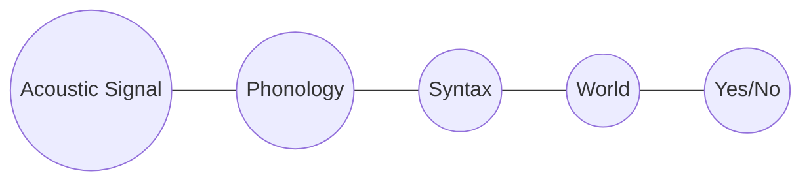

We can point out another observation from Chomsky here: if two sentences sound similar, it does not mean that they contain similar information. For example, it is not the case in English that if two sentences rhyme with each other, one implies the truth of the other.

 why this claim seems correct: slightly subtle point about the nature of syntactic structure
        words with similar phonology aren't usually related semantically: lion vs ion

        but fly vs flying:

        so the relationship is factored through the syntax (and morphology)

important TODO! systematicity

The conditional independency of `Phonology` and `World` given `Syntax` rules out precisely this kind of distribution


## Generalizing this picture


It's obvious that a given answer to a question might depend on previous questions or statements, so really we want a picture more like:

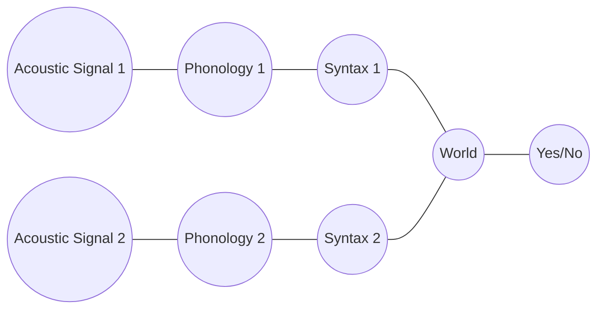

where `Acoustic Signal 2` comes after `Acoustic Signal 1`. This MRF introduces even more conditional independence. In particular, `World` is a sufficient statistic for `Acoustic Signal 2` given `Acoustic Signal 1`.

As a justification of why, note that an agent should indeed gain information about what a future acoustic signal is from a current one. For example

for example, if the first sentence is "John placed the loaded gun on the mantlepiece", this certainly informs our expectations about what follows
    or: "John couldn't believe what he saw."

    however, the dependency is not
        is it mediated by the content


Note that an agent's
    guess about acoustic signal 2
        is informed by acoustic signal 1, as indeed it should be
    What the structure of this MRF claims, however, is that the relationship is factored through `World`.

We can also incorporate vision into the picture being built up here (and other sensory data),
    since the answer to the question might depend on something you see, e.g. "what color is the cat on your lap?"


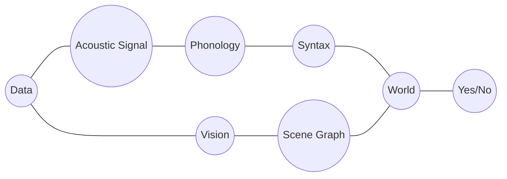

Here, `Scene Graph` is a visual analog of `Syntax`, a sufficient statistic for visual in the form of a data structure.

Does the conditional independency of `Phonology` and `Scene Graph` given `World` make sense?

As a justification, consider that
    Note that this does not mean visual information cannot influence :
    however, the influence of the visual information :
        it is not that when you are looking at a yellow leaf, identifying a /b/ sound in an acoustic signal becomes impossible.

# summary

<!-- ```mermaid
graph LR
    X((Sentence i)) --- D((Content)) --- A((Sentence j))
``` -->


whenever we think of two things as different forms of the same underlying thing:
    **translation implies a conditional independency**
    good: later Quine and no translation

For example,
    it is natural to abstract from a book as a series of symbols, to a book as a piece of semantic content, that is realized in many different languages.

    But in doing so, we are precisely committing to the belief in a sufficient statistic:


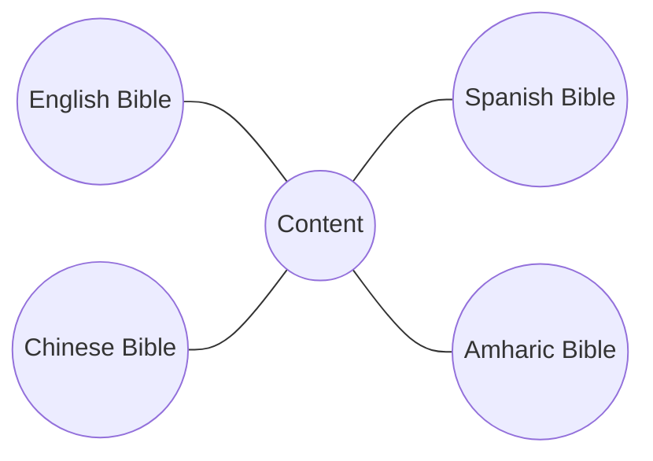


fashion style:

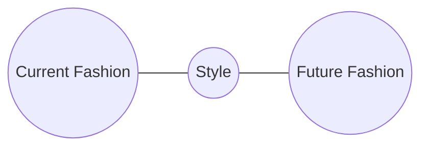


<!-- There are many other examples that could be given of factorizations of $p(I,O)$. For example, we haven't even touched on the ways in which the space of actions that an agent can perform relates to the agent's belief about the state of the world, and how this factors.  -->

<!-- ## Other examples in cognitive science


action doesn't depend on whole of world

conditional independence of future of data from past of actions:
    actually not that obvious -->


<!-- Why a joint distribution? To understand this, note that from the joint distribution, we can obtain expressions for $p(A|D)$ and $p(D)$, i.e. a description of how the agent acts given data, and what the agent believes about the data prior to receiving any. -->


<!-- As such, our scientific goal is to identify what distribution of the form $p(D,A)$ describes a natural agent, like a person. And correspondingly, an engineering goal would be to define such a distribution and draw samples from it (or its conditionals).  -->


<!-- Note that there is a distinction between the *computational specification* of the agent, namely $p(D,A)$, the *algorithmic specification* of approximate inference algorithms efficient enough (in both the computing and statistical sense) to be useful, and the *biological implementation*.  -->


<!-- Everything said so far is consistent with almost any position on the brain: it meets the rare criterion of being something both Skinner and Chomsky would agree to -->


<!-- quote attesting to this -->

<!-- But it also is saying almost nothing (not *quite* nothing though!) -->


## Conditional independence is systematicity

hello example

What does this factorization of the probability distribution imply?

Certainly, a wide range of distributions are still possible. But importantly, some are not. Which?

For example, imagine a distribution p(image, text) that assigned 0 probability to all and only pairs of images with red pixels and text of palindromes (see figure)

This distribution is not in the class of distributions expressable in the factored form above. To see why, say that some such pair

    abba <-> image
    had 0 probability.
    Now suppose we changed the image to
    figure

    Then the probability

## Returning to the debate

The difference between modern and classical AI has nothing to do with the presence or absence of probability in the theory, or the presence or absence of data.
    footnote: for example, the Bayesian
        is entirely classical in its spirit, but entirely Bayesian in its tools.

Rather, it is about how the distribution $p(I,O)$ that describes an agent is factored.

Classical AI and cognitive science makes strong claims about the factoring, often introducing intermediate variables whose values are data types from computer science, like trees or graphs.
    hence the term *symbolic AI*

<!-- A classic example, discussed above, is that a tree structured
    called the syntax is the sufficient statistic for
    *Syntax is the sufficient statistic for meaning given sound*. -->

    The whole point of the outpouring of work in the
    was to characterize this sufficient statistic, often just using people's internal judgments of what sentences sounded grammatical.

It's possible to regard a neural net as an amortized inference algorith for an underlying probabilistic model $p(I,O)$, but even doing that, the various intermediate variables of classical AI do not appear.
So modern AI, along with behaviorism, makes much weaker claims.

As an example, take neural translation. One can view a complex model like a transformer, trained on pairs of English and French sentences, as learning an underlying distribution $p(I,O)$ (where $I$ is the English sentence and $O$ is the French one). However, none of the intervening variables, like `Phonology`, `Syntax` or `Content` are present either implicitly or explicitly.

    The most radical version (in the sense of "radical behaviorism") claims that there is *no* kind of factorization assumption that holds other than trivial ones.
    for example, recall
    French Harry Potter - Content - English Harry Potter

    The claim is that there this sufficient statistic, the `Content` of the book, doesn't exist, or rather only exists if we let it be
        everything.
    what Quine means by the indeterminacy of translation is that
    there is

The real question
    is what the true sufficient statistics look like
    .
    Or, as in radical behaviorism, are there simply none whatsoever, except

    If the former is true, then certainly AI models should take advantage of them.
    If the latter is true, the end-to-end, black box nature of modern neural AI is a feature, not a bug.
        The lack of (spurious) conditional independency is what makes it work


Weaker claims should be preferred over stronger ones in the absence of evidence. So what does the evidence for the stronger claims of classical AI and cognitive science look like?

The first class of arguments are what I would call *appeals to poverty of stimulus*:

    if there were no conditional independencies, the distribution $p(D,A)$ would be unlearnable or, as in the case of neural nets, requires orders of magnitude more data to learn than a human requires
     "By the age of four or five (normal) children have an almost limitless capacity to understand and produce sentences which they have never heard before."

    so the learning problem of finding the right distribution would be too hard without the prior information given by the conditional independence assumptions

response:

    It's not really obvious that a neural net requires
        humans are exposed to an enormous non-stop multimodal stream of data, and what's more, they have the inductive biases of millions of years of evolution. If you think of the training cost of
            GPT3 as playing catch up with evolution,
                then the comparison is less clear cut.


The next class of argumets are *appeals to systematicity*:

    human behavior exhibits systematicity, i.e. evidence for
        factorization assumptions.

    To understand human behavior, and probably to imitate it, we need to characterize those factorization assumptions.


response:

    The response here is skepticism over whether this apparent systematicity is really there.

    Most tellingly, it
        is often made in terms of other proposed sufficient statistics:
        for example, systematicity in
            presupposes a ]

    But phonological structure, syntactic structure, and logical form, are all themselves posited:
        so we are

    neural networks exhibit apparent systematicity

        Tasks that computers can now perform extremely well,
        anyone with half a brain could have told you that it was obvious that no system without a symbolic representation of phonology or phonetics could possibly
            reliably recognize speech.
    And yet, neural

        It is possible to see a neural network as an inference algorithm for an underlyingly Bayesian model
            reference
        but in the case of speech recognition systems, that model does not have the kind of conditional independence assumption that seemed totally obvious to many.

    The response by
        to arguments from systematicity is that the claimed structure which
            has no scientific basis:
                Skinner's point


<!-- And certainly, the evidence for stronger claims is far from compelling -->

The final camp of arguments are what I would call *appeals to "duh!"*. They go like this:

    people can identify grammatical structure, visual structure (objects in a scene),
        and so on. It just seems obvious that these things are *there*.

    "modern AI obviates something which *obviously* exists."
        introspection
    what does it even mean to say that syntax or objects in the world aren't real?

Here, it's worth bearing in my how unreliable human intuition is here.


    possible conclusions:
        statistical methods can learn correct distribution by brute force

Response:
    language and thought are full of concepts which do not translate directly into
        Just because we speak about people's personalities does not mean that a "personality" is a special variable in the

It is futile, of course, to try to give a final word on which side is right (although the author's sympathies are probably clear). But to the extent that it's possible to arbitrate, it's worth doing it in a probabilistic language


# The mind as software

It's worth coming back to the original assumption that an agent can be modeled as a distribution $p(I,O)$.

What assumptions are we making by doing this?

approximate (but so was everything else):
    Data - "World" - Action

`World` =

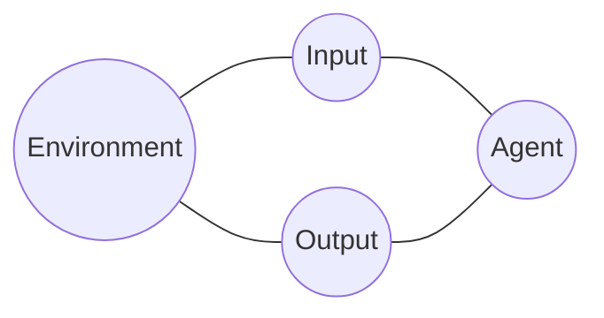


Agent = compile ( approximate (
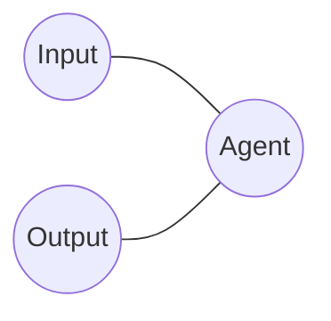
))


Brain - Mind - Behavior

articulate the point about the two levels better:
    ...


        Data
Brain -   |
        Action


                Data
Brain - Mind -    |
                Action

where Mind is a computable function

p(Data)


## Essentialism is also about conditional independence

essential gender

data - world + gender - actions

## manifest image

 Sellars
        distinguishes between the scientific image - the world
            and the manifest image - the world
                full of ideas, trombones, emotions, elbows, longing, and death. Among other things.
                    propositions, percepts,

    The debate is really about objects in the manifest image:
        are they to be handled
            or dissolved
                as linguistic

        two camps
        Also discussed often, but less,
            is the connection to philosophy
    What is less often discussed is that this kind of thinking is part of a larger debate in philosophy:
        of *essentialist* thinking vs ...


key question at the heart of AI is: what is the nature of things?


# Tutorial


To get an intuition for what this means for an agent, let's consider an artificial agent which sees 100 coin flips of a single coin, and then takes the action of deciding whether the coin is biased.

Here $D$ is the sequence of coin flips, $A$ is either "yes, biased", or "no, unbiased".

    A =
    D =
    S =

    vision example
    language example


What is being claimed by such a factorization? Mathematically speaking, we say that figure
    describes the set of distributions in which $D$ and $A$ are conditionally independent given $S$.

    the model should be such that the data space and action space only depend on each other through the state of the world.

So it rules out some possible distributions.
Like what? What is a possible distribution p(A,D), i.e. a possible agent, that is ruled out by this assumption?

In the example of the coin flipper:
    if a prime number, more likely

further factorizations are possible: we can now ask: what about other...

the state of the world is a sufficient statistic for actions given data:
    an agent's decision of how to act should only depend on the data up to the information the data gives about the latent state of the world.
