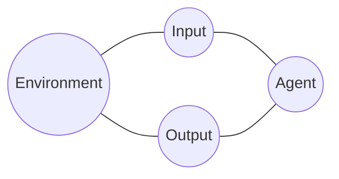
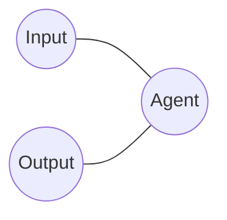

  



the big idea:
    Structure which exists not in our model of the world, but in our model of an agent's model of the world.

    For example,
        things which are alive:
            in our conventional model of an agent, this is a latent variable in its mind

#

x <- [1,2,3]
y <- ...
return ...

what is x? A hollow object

No-one and Odysseus

# convention

Here is an everyday situation. Echo is about the get in to the front seat of a car, opposite the driver, who is sitting there already. She pulls the door handle but finds it locked. Hearing the noise of the handle and seeing the door is shut, the driver ascertains that it is locked, and unlocks it.
		Echo's action has communicated information to the driver, but not through any direct intention to communicate.

		The next time, however, that Echo approaches the car, she suspects it will be locked again. The driver has not noticed, so even though she knows it will not open, she pulls the handle.

		This time, her goal is to communicate to the driver, who in predictable fashion, then opens the door. Her act of communication is based on a presumption about the driver, and how they react to stimuli.

			it's just first order:

		The final time
			she says "open the door". She has to assume that this utterance will cause the driver to open the door. But this requires the driver to know that "open the door" has this meaning.
				And so she must know that the driver knows that "open the door"...

The reality of linguistic structure, like the phonemes in an acoustic signal is a matter of convention.

    If the signal is produced on the assumption
        then
    In other words, the collective belief that phonological and syntactic structure is real is sufficient to make it so.

We get data, and infer a world (collectively! hence convention can appear)

data - world - action

this world is an effective latent variable, since we only need it insofar as our action space is concerned, and that may have an ecologically biased distribution

it is the manifest image of the world, and consists of physical objects, but also agents, along with their perceived inputs and outputs

# essences are conditional independencies in the data

moreover, strong conditional independencies are assumed with the data, essentialist assumptions like that the observed color of a surface is a property of the surface

included in this model of the world is a *conventional* model of an agent - conventional because it is an s0

data - chairData
 |        |
world - chair

contrast with:

data - voiceData
 |        |
world - speedOfVoice

or: data - pitchOfMusic

# The mind as software

the mind is an s0 convention

          otherHardware
            |
Behavior - Mind - Brain

these are marr's levels

how does this fit in?

It's worth coming back to the original assumption that an agent can be modeled as a distribution $p(I,O)$.

What assumptions are we making by doing this?

approximate (but so was everything else):
    Data - "World" - Action

`World` =

Agent = compile ( approximate (

))

Brain - Mind - Behavior

articulate the point about the two levels better:
    ...

        Data
Brain -   |
        Action

                Data
Brain - Mind -    |
                Action

where Mind is a computable function

p(Data)

# hello example

hello example

What does this factorization of the probability distribution imply?

Certainly, a wide range of distributions are still possible. But importantly, some are not. Which?

For example, imagine a distribution p(image, text) that assigned 0 probability to all and only pairs of images with red pixels and text of palindromes (see figure)

This distribution is not in the class of distributions expressable in the factored form above. To see why, say that some such pair

    abba <-> image
    had 0 probability.
    Now suppose we changed the image to
    figure

    Then the probability

## Essentialism is also about conditional independence

essential gender

data - world + gender - actions

## manifest image

 Sellars
        distinguishes between the scientific image - the world
            and the manifest image - the world
                full of ideas, trombones, emotions, elbows, longing, and death. Among other things.
                    propositions, percepts,

    The debate is really about objects in the manifest image:
        are they to be handled
            or dissolved
                as linguistic

        two camps
        Also discussed often, but less,
            is the connection to philosophy
    What is less often discussed is that this kind of thinking is part of a larger debate in philosophy:
        of *essentialist* thinking vs ...

key question at the heart of AI is: what is the nature of things?

# Tutorial

To get an intuition for what this means for an agent, let's consider an artificial agent which sees 100 coin flips of a single coin, and then takes the action of deciding whether the coin is biased.

Here $D$ is the sequence of coin flips, $A$ is either "yes, biased", or "no, unbiased".

    A =
    D =
    S =

    vision example
    language example

What is being claimed by such a factorization? Mathematically speaking, we say that figure
    describes the set of distributions in which $D$ and $A$ are conditionally independent given $S$.

    the model should be such that the data space and action space only depend on each other through the state of the world.

So it rules out some possible distributions.
Like what? What is a possible distribution p(A,D), i.e. a possible agent, that is ruled out by this assumption?

In the example of the coin flipper:
    if a prime number, more likely

further factorizations are possible: we can now ask: what about other...

the state of the world is a sufficient statistic for actions given data:
    an agent's decision of how to act should only depend on the data up to the information the data gives about the latent state of the world. -->
