  

## Symbolic AI

I have misgivings about the project of symbolic AI. This is an attempt to convey them succinctly.

First, let me try to state what I think a (modern) symbolic AI perspective looks like, with examples from language and vision in mind.

 Let's say that $I$ (short for *input*) is an acoustic signal corresponding to a natural language polar question (like "Were there sharks in the ocean before there were trees on land?"), and $O$ (short for *output*) is a boolean choice between "Yes" and "No". Our scientific goal is in characterizing the mapping from $I$ to $O$, which describes how humans are able to answer a huge variety of such questions, previously unheard. Our engineering goal is to replicate this ability in a computer.

 (I chose these $I$ and $O$ for the sake of a concrete example, but if you are more abstractly inclined, imagine $I$ as all sensory data received by an agent over all time until the present, and $O$ as all future actions.)

  

In probabilistic terms, such an agent is characterized by a joint distribution $p(I, O)$. (It might look more familiar to talk about a conditional $p(O|I)$ or a prior $p(I)$, but both can be obtained from $p(I,O)$).
  

There's a whole range of distributions of the form $p(I,O)$, each corresponding to a different possible model of human question answering behavior. The goal is to specify the one that adequately describes human behavior. (Note, in the spirit of Marr's levels of explanation, that it's a separate task to work out how an agent would actually approximate $p(O|I)$ or how that approximate inference algorithm is instantiated in the brain.)

More graphically, we write $p(I,O)$ as

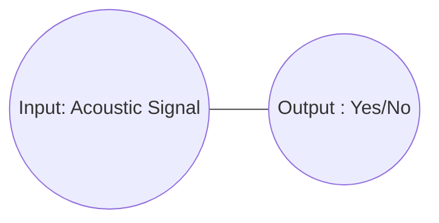

  

The diagram above denotes a *Markov random field* (MRF), which is a probability distribution specified by

  

$$ p(i,o) \propto f(i,o) $$

  where $f(i,o)$ is some function of $i \in I, o \in O$ that returns a real number. 
  
  
Symbolic AI (here I'm thinking of Chomsky, for example) doesn't (in my understanding) dispute the existence of $p(i,o)$ so defined, but rather claims that we can further constrain the space of possible distributions $p(i,o)$. In particular, the distributions that are of interest are of the form:
  

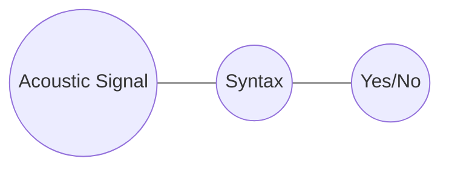

where `Syntax` is the space of syntactic trees like:

```
     /\
    /  \
   /    \
  /     /\
 /     /  \
Tim knows Tom
```
This MRF corresponds to a distribution

$$p(i,s,o) \propto f(i,s)f(s,o)$$

  

and the relevant joint distribution $p(i,o)$ can be recovered by marginalizing out $s$. That is: $p(i,o) = \int_{s \in S} p(i,s,o)$.

  

In the terminology of probability, we say that we have factorized the model such that `Acoustic Signal` and `Yes/No` are **conditionally independent** given `Syntax` (or equivalently, we say that `Syntax` is a **sufficient statistic** for `Yes/No` given `Acoustic Signal`.)

  
What does this factorization assumption imply? The really important thing to note is that not all distributions of the form

  

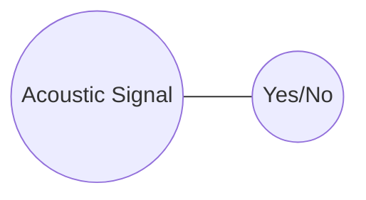

  

can be expressed by marginalizing out `Syntax` from a distribution of the form:

  


  

As an example of a distribution which cannot, consider the distribution in which all pairs of acoustic signals with low frequencies in their spectrum and "Yes" have the same probability mass (or probability density). That is $p(signal,  \mathit{Yes}) \propto I[low\_freq(signal)]$.

  

This cannot be expressed in the factored model, because syntax trees throw away acoustic information, so there's no way of enforcing this relationship between `Acoustic Signal` and `Yes/No`.

  

Note that this factorization of $p(i,o)$ is not just the claim that *some* sufficient statistic like `Syntax` exists; it's always possible to choose a space $S$ such that

  

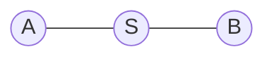

  

spans the same space of possible distributions as

  

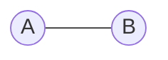

  

e.g. by letting $S$ by the Cartesian product of `A` and `B`. Rather, the substantive claim is that $S$ looks a certain way, in this case, that elements of `Syntax` are trees generated by a particular grammar. It is this that makes the factorization a real substantive claim.

So *the validity of this claim really depends on the nature of the factorizing variables*. Indeed, if you look at pushback to the Chomskian picture, in large part it revolves around scepticism that syntactic trees belong in the description of the agent at all.

## Generalizing this perspective

At any rate, the intuition is that the factorization simplifies the problem by breaking it apart into two simpler questions: how sound and syntax relate, and how syntax and response relate. In other words, we can now put our focus into:

  

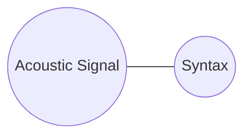

  

and

  

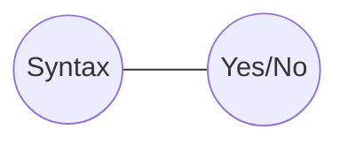

  

The next natural step is to factorize each of these. For example:

  

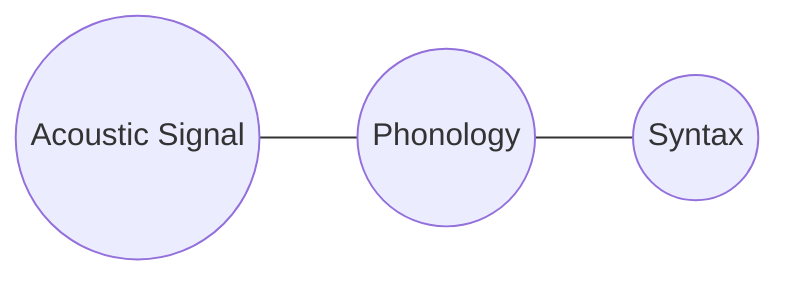

  

where the phonological representation in `Phonology` is a sequence of *phonemes*, constrained by a different set of rules to the syntax.

  

This new conditional independence assumption rules out, among others, the distribution in which all pairs of a high pitch acoustic signal and a tree with an adjective have the same probability.

  
  

Another factorization to make is:

  

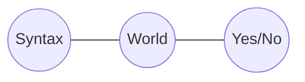

  

where `World` is the state of the world, i.e. the state of the system which produced all the sensory data the agent receives.

  

This says that the `Yes/No` answer depends on the syntax only insofar as the syntax is used to update the agent's information about the state of the world.

  

To give an example of the kinds of unreasonable distributions that the independence assumption rules out, a distribution in which all pairs of `Yes` and any tree with more than 4 nodes have the same probability, cannot now be defined. Unless, that is, precisely those trees correspond to some special state of the world, and we assume they do not.

  

Putting this all together, we have:

  

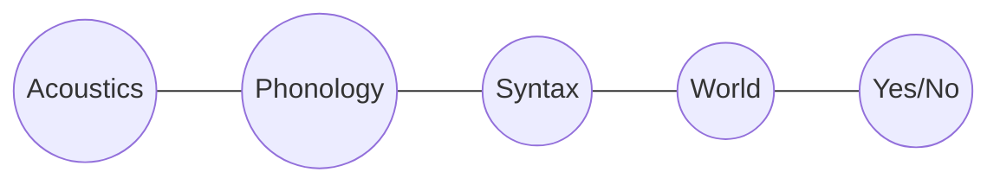

  

One more conditional independency that is evident from this graph is between `Phonology` and `World` given `Syntax`.

  

This corresponds to a well-known observation, which is that the meaning of a linguistic utterance does not depend on the way it sounds (except via the way that the sound relates to the syntax). For instance, sentences with a similar phonology like "The lion desists" and "The ion exists" may well incur very different belief updates about the state of the world.

  

Another example of a similar point is that it is never the case in languages that words that bear a phonological relationship (like rhyming) systematically also bear a semantic relationship (like denoting similar things).

  

This lack of a systematic relationship is precisely a statement about independence.

  

In particular, it's a statement about *conditional* independence. Phonology and semantics are not truly independent - "fly" and "flying" mean similar things, but **conditional** on syntactic (and more specifically what's called morphological structure), phonology and meaning are independent.

  
  
## Generalizing beyond language

  

It's obvious that an answer to a given question might depend on previous questions or statements, so really we want a picture more like:

  

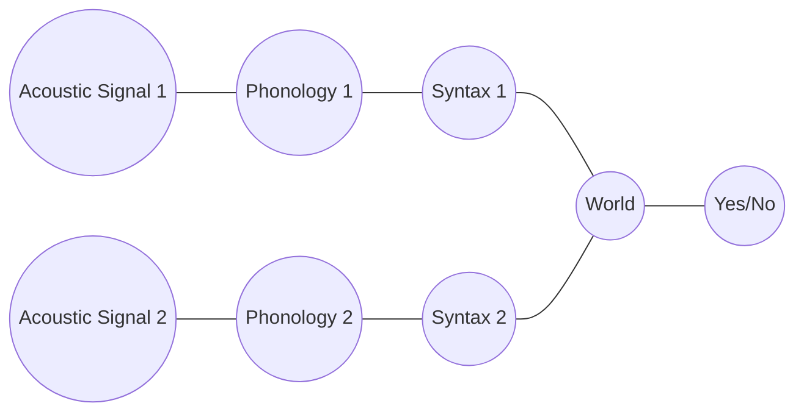

  

where `Acoustic Signal 2` comes after `Acoustic Signal 1`. This MRF introduces even more conditional independence assumptions. In particular, `World` is a sufficient statistic for `Acoustic Signal 2` given `Acoustic Signal 1`.

  

As a justification of why this might be a reasonable claim, note that an agent should indeed gain information about what a future acoustic signal is from a current one, but probably only in terms of the information about the world it contains.

  

For example, if the first sentence is loud, we might expect the next one to be, but only because we infer, for example, that the speaker is angry and we know that this is likely to last until the next utterance.

  
  

We can also incorporate vision into the picture being built up here (and other sensory data), since the answer to the question might depend on something you see, e.g. "what color is the cat on your lap?"

  
  

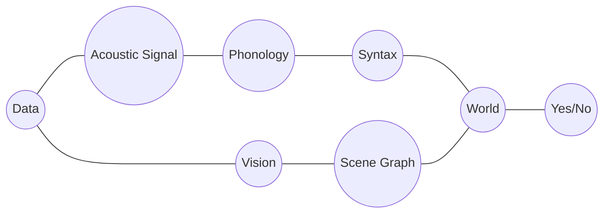

  

Here, `Scene Graph` is a visual analog of `Syntax`, a sufficient statistic for visual in the form of a data structure representing the objects in the world.

  

Does the conditional independency of `Phonology` and `Scene Graph` given `World` make sense?

  

As an example, it rules out distributions in which all pairs of a phonological structure containing a /b/ phoneme, and scene graps containing a chair have the same probability, which seems sensible.

  

And it allows distributions in which precisely those phonological structures which correspond to sentences about chairs have higher probability than not of appearing with scene graphs containing chairs.


## Is this perspective reasonable?

  A language model (or a related connectionist system that handles acoustic input) can be viewed as a distribution $p(i,o)$; the standard criticism is that it doesn't factor in the way that symbolic AI predicts, so that one cannot break ChatGPT into one module that parses a sentence, and another than interprets it, for example.

The central question then is what the right factorizing variables are. The weakest claim is that there are none except the Cartesian product $I \times O$. Language models can be 
parametrized, but this is still an extremely weak factorizing assumption.

#### Why might you expect that there should be stronger factorization?

If you are in a domain where you *know* that there is extra structure by design, then this should be taken into account. For example, suppose that the task in question is to answer questions about Mario:


like "is Mario in the air". Then the input $I$ is a pair of an acoustic signal and an array of pixels. At the very least, the distribution $p(i,o)$ should factorize as
todo

This is because we know the generative process behind the pixel array, namely the program (the Mario computer game) that was used to generate it.


This reasoning is true even if there is uncertainty on the input image: the way an agent should 


the general feeling from the perspective of symbolic AI
is that the world is analogous to the Mario game: a visual scene can be decomposed into objects with properties like color, shape, mass, etc

Modern symbolic approaches 
therefore typically try to explicitly include 


  
  

But there is *no* kind of factorization assumption in the model. Or rather, there are intermediate latent variables in the system's architecture, but they don't correspond to anything obviously interpretable, like syntactic structure, or a 1st order logic's representation of world knowledge.

  

Is this a bad thing? A good thing? That rather depends on whether you believe those latent variables are part of the true structure of the world. If yes, then something like ChatGPT can only perform well to the extent that it approximates them.

  

On the other hand, if you are sceptical about the nature of these latent variables, then their absence in neural AI systems might seem rather like a feature. Of course, being sceptical about things like syntactic structure or sentential meaning is a hard route to go down (see the above examples) and you need to explain why these things *appear* to be present in cognition.

  
  
  
  
  
  
  

Weaker claims should be preferred over stronger ones in the absence of evidence. So what does the evidence for the stronger claims of classical AI and cognitive science look like?

  

The first class of arguments are what I would call *appeals to poverty of stimulus*.

  

They go like this: if there were no conditional independencies, the distribution $p(I,O)$ would be unlearnable or, as in the case of neural nets, would require orders of magnitude more data to learn than a human does. (In Chomsky's words: "By the age of four or five (normal) children have an almost limitless capacity to understand and produce sentences which they have never heard before.")

  
  
  

<!-- Here, the response a Quine or a Skinner might make is this:

humans are exposed to an enormous non-stop multimodal stream of data, and what's more, they have the inductive biases of millions of years of evolution. If you think of the training cost of, say GPT3, as playing catch up with evolution, then the comparison to human learning is much less clear cut. -->

  
  
  

The other set of arguments are what you could call *appeals to "duh!"*. They go like this: people can identify grammatical structure, visual structure (objects in a scene), and many other symbolic objects that appear in cognition. When someone tells me that my keys are in the kitchen, and I go to the kitchen, it would be bizarre to understand that behavior in terms of the acoustic signal I receive and the motor movements I make. It just seems obvious that these things are *there* and need to be worked into AI systems.

  

While there are ways to respond to both these criticisms, it is futile, of course, to try to give a final word on which side is right.